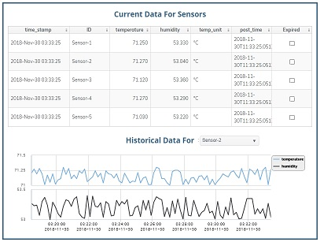

# RTView<sup>&reg;</sup> for JavaScript

## Overview

The `RTView-Javascript` repository  provides instructions and examples showing how to push real-time monitoring data from a Javascript application into an instance of an RTView DataServer and how to use RTView Cloud to create custom dashboards to display the data in real-time.

RTView is a real-time data management, visualization and analytics engine provided by SL Corporation (www.sl.com). It is used by organizations worldwide as a key component of mission-critical monitoring and control systems, built around various middleware, infrastructure and IoT data sources.

The RTView DataServer is the data management component that provides in-memory caching and archival to persistent storage. Data stored there may be consumed by displays, dashboards, reports and alerts provided by a visualization and analytics tool such as RTView Cloud.

One of the sample displays created in this example is shown below:



By following the steps described below you will:

* Create an account on RTView Cloud.
* Download and run an RTView DataServer on your local computer, which will provide real-time data caching and historical archival.
* Run a Node.js program that simulates a few temperature/humidity sensors and populates the RTView DataServer.
* Import a sample display into RTView Cloud, showing real-time data coming from the Node.js program.

## Requirements
To run this project, you will need to have installed on your computer:
```
Node.js version 6 or higher

Java version 1.7 or higher
```

## Create an RTView Cloud account
An RTView Cloud account provides the tools for creating, viewing and publishing rich graphical displays connected to real-time data sources.

* In a browser, go to [RTView Cloud](http://rtviewcloud.sl.com/).
* Click on Start Free Trial to create your account (skip if you have an account already).
* Login to your RTView Cloud account.

Note that you are automatically placed into your own private organization (e.g. JohnSPrivateOrg).
	
## Download and run the RTView DataServer	

* From your RTView Cloud account, click on the ? icon at upper right to go to the Support page.
* Select Downloads and elect to download the RTView DataServer to your computer.
* Unzip the downloaded **RTViewDataServer_?.?.?.?.zip** file to a directory of your choice.
* Open a Command Window or Linux Shell in that directory.

To start the RTView DataServer:
```
cd RTViewDataServer

start_server          (or ./start_server.sh in Linux)
```
The RTView DataServer is now ready to receive data at the following http URL:
```
http(s)://localhost:3270/rtvpost
```
At any time you can stop the server:
```
stop_server           (or ./stop_server.sh in Linux)
```
## Download and run the RTView-JavaScript connector program

Clone the RTView-JavaScript to your local computer and follow the steps below to install and run the RTView Simple Example program. This simple Node.js program creates data for a few sensors and populates the RTView DataServer, which provides current and historical caching of incoming metric values for display purposes. Our use of the word connector in reference to this script is due to the fact that in a non-simulated scenario, one of the tasks that this script will be in charge of is to connect to the actual source of data.

To install the connector program:
```
cd RTView-JavaScript

npm install
```
To start the program:
```
node simple-example
```
This program can be modified to bring in custom data specific to your application.
Note that this example makes use of a node package containing utility functions for communicating with RTView. This 'rtview-utils' package is referenced in the package.json file and is loaded automatically as part of the npm install.

Documentation can be found at:   [rtview-utils documentation](https://www.npmjs.com/package/rtview-utils)

## Import and view the sample display

* In a browser, go to [RTView Cloud](http://rtviewcloud.sl.com/).

* Define a connection to the RTView DataServer running on your local system:
```
On the RTView Cloud top menu bar, select Data.
Select the Add RTView Server button.
In the Add RTView Server dialog enter:

	Name:       SIMPLE-EXAMPLE-SERVER
	Host/URL:   http://localhost:3270/rtvquery

Click on Save Added Servers.
```
* Test that the connection is successful:
```
Click on the green magnifying glass icon next to the SIMPLE-EXAMPLE-SERVER entry.
This will invoke the RTView DataServer - Cache Tables dialog.
Verify that you see "Connected" under Connection Status. 
Verify that you see SensorData in the CacheTable.
Close the dialog.
```
* Import the sample display:
```
On the RTView Cloud top menu bar, click on Design to invoke the RTDraw visual editing tool.
Select the File dropdown menu and click on Import.
Select "as Private". 
In the file browser, navigate to the RTView-JavaSccript directory within this project on your computer.
Select the SimpleExample.json and click Open.
```
* View or edit the sample display:
```
Select the File dropdown menu and click on Open...
Double click the name of the display you just imported, to open and view it in real-time.
```
This sample display is configured to connect to your local RTView data server and present data changing in real-time.
You can experiment with the editing features of RTDraw to make changes to these displays or create your own.

## Achieved Goals
In this RTView JavaScript you will have achieved the following: 
* Seen how easy it is to display user data in graphical and highly configurable displays in the Cloud.
* Launched the simple node program used to create and send data to RTView.
* Seen how users are able to view or enhance a sample RTView display or create new displays.

**Feel free to experiment with, modify or enhance this project, and share your experience, comments and suggestions with us. Please fork this repo and submit a pull request for any changes you would like to suggest.**

